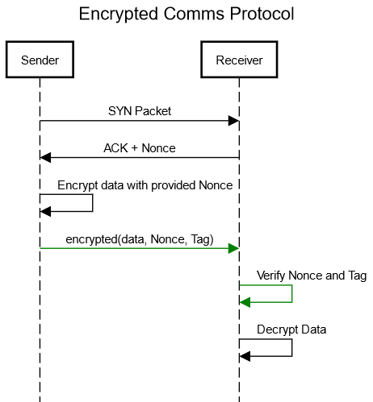
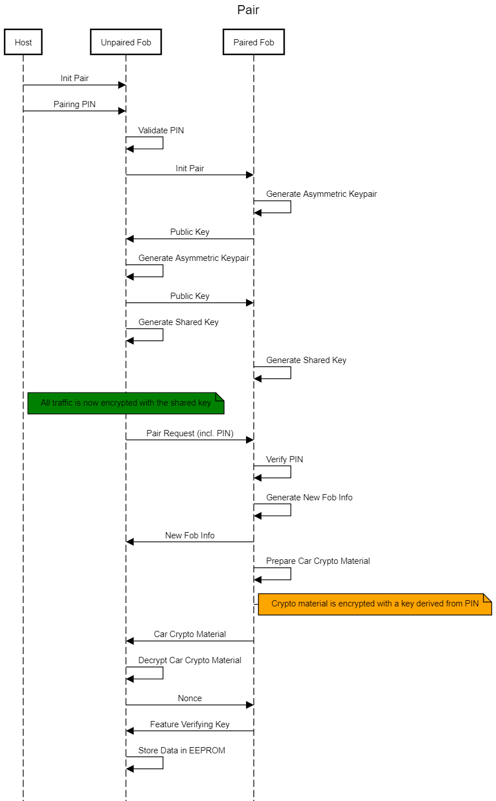
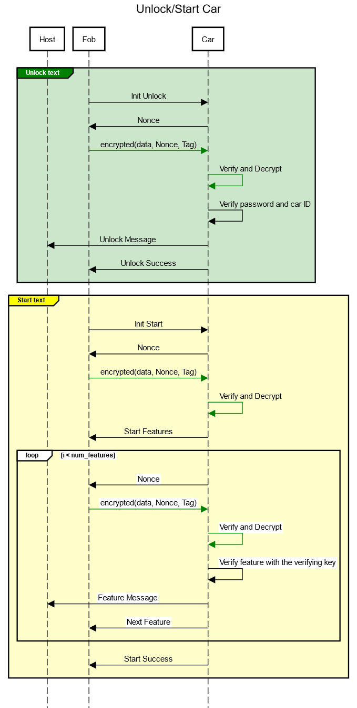

# **Encrypted packet format**

- **Total packet length: 128 bytes**
  

## Encrypted Communications Protocol

All communications in green are encrypted

# **Host tools**
## Package
- Create feature packets. For each feature, encrypt the following using standard encryption protocol:
    - Car ID
    - Feature number

## Pair (unpaired fob)

    

- Host tool puts unpaired fob in pairing mode
- Host tool sends pairing PIN to unpaired fob
- Unpaired fob validates PIN (just format checking)
- Unpaired fob puts paired fob in pairing mode
- Paired fob generates ephemeral asymmetric keys
- Paired fob sends public key to unpaired fob
- Unpaired fob generates ephemeral asymmetric keys
- Unpaired fob sends public key to paired fob
- Both fobs generate a shared secret key that is used to en/decrypt all future traffic
- Unpaired fob sends pairing request with PIN to paired fob
- Paired fob verifies PIN
- Unpaired fob sends Nonce to paired fob
- Paired fob sends identity/crypto data to unpaired fob
- Unpaired fob decrypts and saves identity/crypto data to EEPROM
- Unpaired fob sends success code to host tool.

## Unlock car

    

---- Nothing below this has been changed ----

- Host sends prepackaged feature packet to fob
- Fob verifies feature packet
- Fob sends acknowledgement indicating feature is enabled

# **Fob**
## Pair
See Pair host tool.

## Unlock car, start car

**Unlock**
- Button on fob triggers unlock
- Fob sends unlock packet to car
- Car verifies fob with challenge/response
- Car unlocks and sends acknowledgement
 

**Start**
- Button on fob triggers start
- Fob sends start packet to car
- Car verifies fob with challenge/response
- Car unlocks and sends acknowledgement

## Enable feature
See Enable Feature host tool.

# **Car**
Car doesn't have much interesting functionality, see fob and host functions above.

